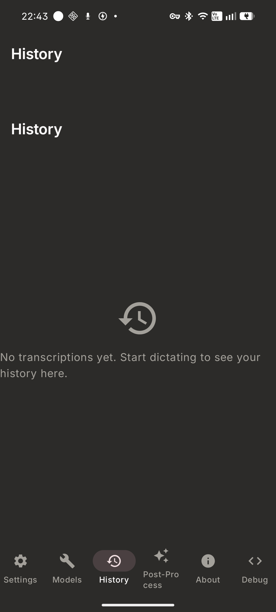
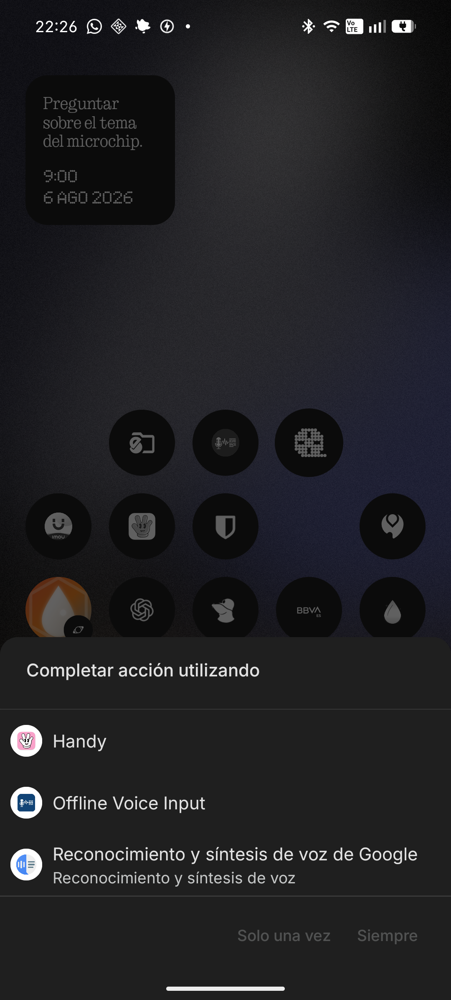
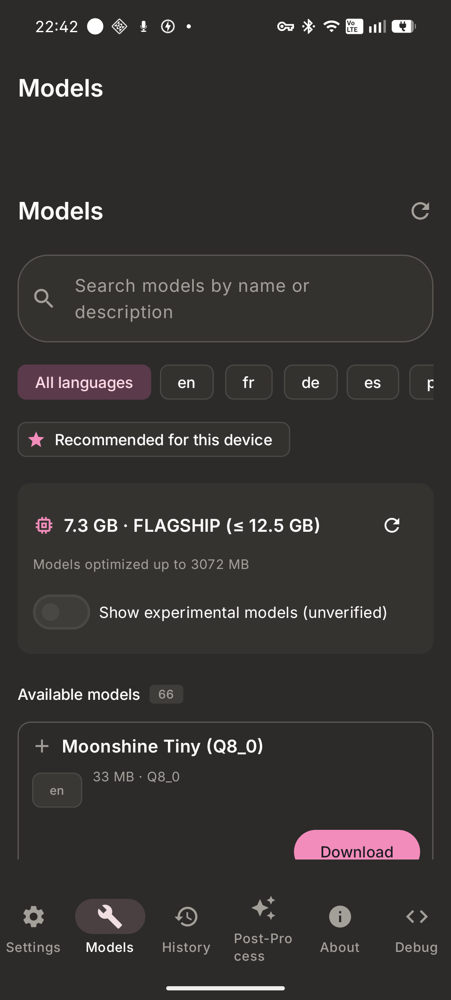
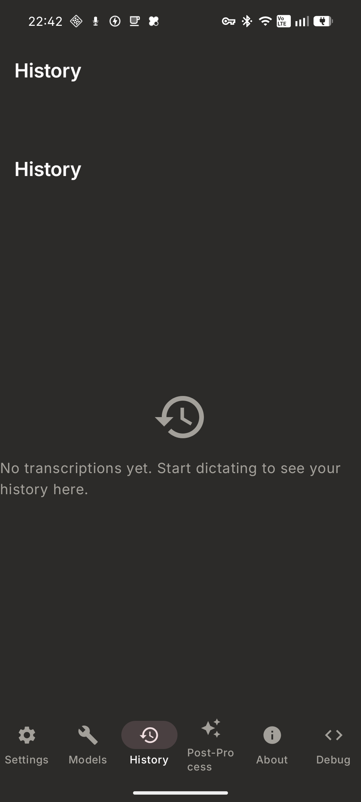
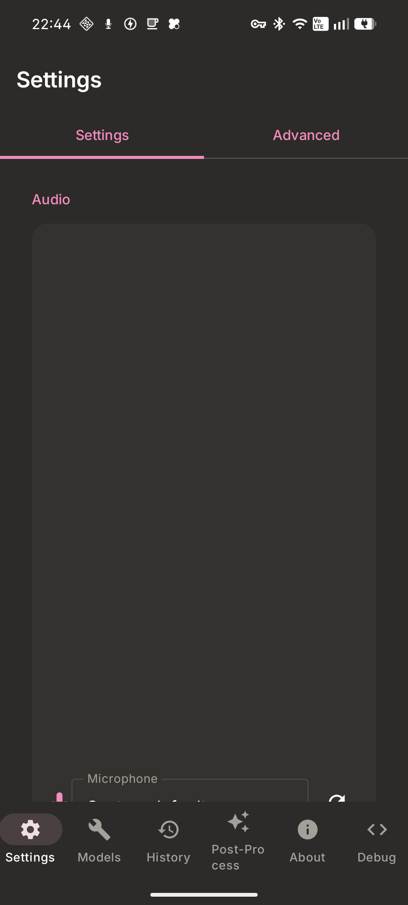

# Handy for Android

Private, offline, on-device speech-to-text for Android. Powered by Rust, `whisper.cpp`, and Jetpack Compose.

[](LICENSE)
[](https://developer.android.com)
[](handy-android/BUILD.md)

Handy for Android is a native port of [Handy](https://github.com/cjpais/Handy). It brings local, zero-latency speech recognition to Android devices without cloud dependencies, API subscriptions, or privacy trade-offs.

---

## Previews

| History & Audio Player | System Voice Recognition | Model Catalog |
| :---: | :---: | :---: |
|  |  |  |

| Phonetic Dictionary | Settings & Configuration |
| :---: | :---: |
|  |  |

---

## Features

### On-Device Speech Recognition
- **Native Rust Core (`handy-core`)**: High-performance JNI bridge compiled with `whisper.cpp` / GGML and Silero Voice Activity Detection (VAD).
- **100% Private & Offline**: Speech recognition runs entirely on your device. Audio recordings and transcriptions never leave local storage.
- **Hardware-Aware Model Selection**: Automatically classifies hardware capability (LOW to TABLET) and recommends optimal GGUF models (Whisper, Canary, Nemotron, Parakeet, Qwen3-ASR) based on available RAM.

### Android System Integration
- **Material Design 3 IME Keyboard**: Custom input method service featuring a floating pill overlay with 6-state spring animations to dictate into any Android application.
- **System Speech Recognition Service**: Native implementation of `android.speech.RecognitionService` for applications invoking `RECOGNIZE_SPEECH` intents.
- **Cascading Text Injection**: Inserts text via active IME `InputConnection`, Shizuku system service (`KEYCODE_PASTE`), or clipboard fallback.
- **System Overlay & Audio Feedback**: System-wide floating dictation overlay button and native audio feedback tones.

### Post-Processing & Phonetic Correction
- **Phonetic Corrector (`WordCorrector`)**: Combines Soundex, Levenshtein distance, N-gram matching, and configurable filler word ("um", "uh", "like") filtering.
- **Custom User Dictionary**: Define specialized jargon, technical terms, and proper nouns for automatic phonetic correction.
- **LLM Text Transformation**: Optional post-processing via local (Ollama) or remote (OpenAI, MiniMax, Cohere) endpoints with prompt presets and system/user role separation.

### UI & Storage
- **Adaptive Material Design 3**: Dynamic navigation supporting mobile phone layouts (`NavigationBar`) and tablet/foldable layouts (`NavigationRail`).
- **WAV History & Dual-Write Storage**: Persistent audio recording storage with integrated playback, transcription retries, search, and automatic eviction policies.
- **Dynamic Localization & Themes**: Live theme (Dark/Light/System) and locale adjustments without activity recreation.

---

## Hardware Tiers & Recommended Models

Handy classifies hardware capabilities on launch to recommend models that match available device RAM:

| Tier | Available RAM | Primary Recommended Model | Alternative Models |
|---|---|---|---|
| **LOW** | ≤ 1.5 GB | Whisper Base | Whisper Tiny, Moonshine Tiny, MedASR |
| **MID** | ≤ 3.5 GB | Nemotron 3.5 Streaming | Canary 180M Flash, Parakeet TDT 0.6B, Whisper Medium |
| **HIGH** | ≤ 6.5 GB | Whisper Large V3 Turbo | Qwen3-ASR 1.7B, Canary 1B V2 |
| **FLAGSHIP** | ≤ 12.5 GB | Whisper Large V3 | Granite Speech 4.1 2B+, Canary Qwen 2.5B |
| **TABLET** | > 12.5 GB | Cohere Transcribe | Granite Speech 4.1 2B, Granite 4.0 1B |

---

## Project Structure

```
Handy-Android/
├── handy-core/                # Rust native engine (cdylib JNI bindings)
│   └── src/
│       ├── audio/             # AAudio capture, Rubato resampling, Energy VAD
│       ├── transcription/     # Whisper.cpp / GGML model execution
│       └── model/             # GGUF catalog and downloader
└── handy-android/             # Android application (Kotlin & Jetpack Compose)
    └── app/src/main/java/com/handy/app/
        ├── audio/             # Audio storage repository & WAV recorder
        ├── bridge/            # JNI bindings to handy-core
        ├── corrector/         # Soundex + Levenshtein phonetic corrector
        ├── ime/               # Input Method Service & floating pill UI
        ├── injection/         # Text injection router (IME, Shizuku, Clipboard)
        ├── postprocessing/    # LLM integration & prompt manager
        ├── service/           # VoiceRecognitionService & Overlay service
        └── ui/                # Material Design 3 screens & components
```

---

## Building from Source

### Prerequisites

- **Java Development Kit**: JDK 17+
- **Android SDK & NDK**: API 35 SDK, NDK r27+
- **Rust Toolchain**: `rustup` with target `aarch64-linux-android`
- **cargo-ndk**: `cargo install cargo-ndk`

### Quick Build Commands

```bash
# Navigate to the Android project root
cd handy-android

# Compile Kotlin and run unit tests (180+ tests)
./gradlew :app:compileDebugKotlin :app:testDebugUnitTest

# Build debug APK
./gradlew :app:assembleDebug

# Install on a connected Android device via ADB
./gradlew :app:installDebug
```

For release builds and advanced NDK configuration, see [BUILD.md](handy-android/BUILD.md).

---

## Text Injection Architecture

| Strategy | Priority | Context | Requirement |
|---|---|---|---|
| **IME InputConnection** | 1st (Primary) | Active text field focused | Active IME selection |
| **Shizuku Service** | 2nd | Background or third-party input | Running Shizuku environment |
| **Clipboard** | 3rd (Fallback) | System clipboard buffer | None |

---

## License & Attribution

Distributed under the [MIT License](LICENSE).

Handy for Android is an Android port of [Handy](https://github.com/cjpais/Handy) created by CJ Pais.
