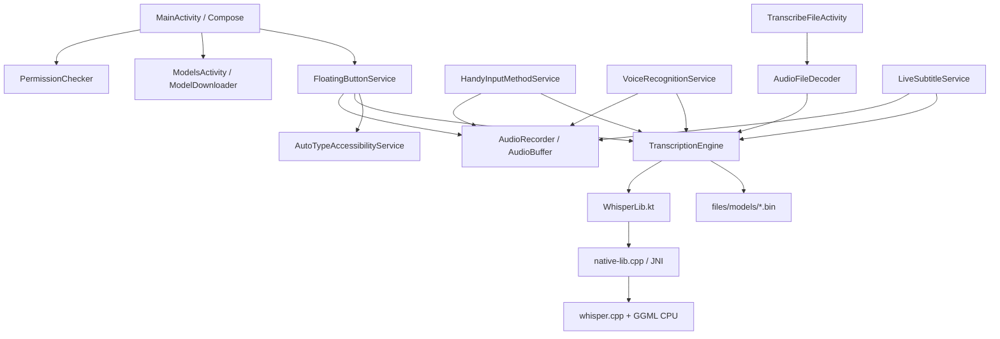

# Handy Android — Especificación técnica viva

> Esta es la especificación técnica vigente del módulo Android `com.handy.android`. Describe su arquitectura actual, las decisiones verificadas y las limitaciones conocidas.

## 1. Alcance

Handy Android es el port móvil de la experiencia local de Handy de escritorio:

1. capturar voz desde Android;
2. ejecutar Whisper/GGML localmente;
3. mostrar estado mediante overlay o IME;
4. insertar el texto en el campo enfocado o devolverlo a un cliente Android;
5. permitir gestión local de modelos.

El proyecto Android vive como módulo Gradle independiente en la raíz. La aplicación Tauri sigue siendo el producto de escritorio y tiene su propio backend Rust, frontend y pipeline de build.

## 2. Arquitectura



### Componentes

- `MainActivity.kt`: onboarding, estado de permisos y navegación.
- `PermissionState.kt`: micrófono, notificaciones Android 13+, overlay y accesibilidad.
- `AudioRecorder.kt`: `AudioRecord` en 16 kHz mono PCM 16-bit.
- `AudioBuffer.kt`: buffer thread-safe; ofrece snapshot y `drain(maxSamples)` para ventanas de streaming.
- `FloatingButtonService.kt`: foreground service de micrófono con botón overlay.
- `AutoTypeAccessibilityService.kt`: busca el campo de entrada enfocado y ejecuta `ACTION_SET_TEXT`.
- `HandyInputMethodService.kt`: IME con botón de grabación y `commitText`.
- `VoiceRecognitionService.kt` y `RecognizeActivity.kt`: APIs de reconocimiento del sistema.
- `ModelsActivity.kt`: descarga, importación, validación y selección explícita de modelos.
- `ModelDownloader.kt`: descarga HTTPS a `.part`, validación SHA-256/Whisper y reemplazo final del modelo.
- `ModelValidator.kt`: hash SHA-256, metadata local y carga real mediante JNI antes de activar.
- `AudioFileDecoder.kt`: MediaExtractor/MediaCodec, mono y resampling a 16 kHz.
- `TranscribeFileActivity.kt`: entrada `ACTION_VIEW`/`ACTION_SEND`, `ClipData` y URI `content://`.
- `LiveSubtitleService.kt`: overlay foreground y ventanas periódicas de transcripción local.
- `WhisperLib.kt`: wrapper lifecycle-safe del contexto nativo.
- `native-lib.cpp`: carga, inferencia greedy, mutex por contexto, cancelación atómica, protección de lifetime JNI y conversión de errores.
- `HistoryDatabase.kt` / `HistoryRepository.kt`: almacenamiento SQLite local para guardar el historial de transcripciones (ID, texto, fecha, duración, modelo y fuente).
- `HistoryScreen.kt`: interfaz Compose Material3 para buscar, copiar, compartir y eliminar transcripciones del historial.
- `AudioFeedbackManager.kt`: reproductor de efectos de sonido (`SoundPool`) y motor de vibración háptica (`Vibrator` / `VibratorManager`) para eventos de inicio, fin y éxito de transcripción.
- `PostProcessor.kt`: motor local de postprocesado de texto que ejecuta reglas de sustitución de vocabulario (`key = value`), normalización de puntuación/espacios y autocapitalización de oraciones; se invoca desde `TranscriptionEngine` antes de entregar el texto a los servicios consumidores.

## 3. Build Android

Configuración actual:

- namespace/application ID: `com.handy.android`;
- `compileSdk = 35`, `targetSdk = 35`, `minSdk = 26`;
- JDK 17;
- Gradle wrapper 8.9;
- Android Gradle Plugin 8.7.3;
- Kotlin 2.0.21;
- CMake 3.22.1;
- NDK 27.0.12077973;
- ABIs que actualmente compila la configuración local: `armeabi-v7a`, `arm64-v8a`, `x86`, `x86_64`; la lista de ABIs con soporte oficial de distribución debe fijarse explícitamente antes de publicar, idealmente mediante `abiFilters`;
- backend nativo actual: CPU portable; Vulkan, OpenCL, Metal, OpenMP y `GGML_NATIVE` están desactivados deliberadamente.

Comandos canónicos:

```bash
./gradlew lintDebug
./gradlew testDebugUnitTest
./gradlew assembleDebug
./gradlew assembleRelease
```

La CI `.github/workflows/android.yml` instala explícitamente SDK 35, Build Tools 35.0.0, CMake 3.22.1 y NDK 27.0.12077973.

## 4. JNI y Whisper/GGML

Las firmas JNI deben coincidir exactamente con `WhisperLib.kt`:

```cpp
Java_com_handy_android_WhisperLib_initContext
Java_com_handy_android_WhisperLib_freeContext
Java_com_handy_android_WhisperLib_fullTranscribe
Java_com_handy_android_WhisperLib_cancelTranscribe__J
```

> Nota: `WhisperLib` declara `external fun cancelTranscribe(context: Long)`, cuyo símbolo JNI es `Java_com_handy_android_WhisperLib_cancelTranscribe__J` (el sufijo `__J` codifica el único parámetro `long`). La variante sin sufijo no existe en Kotlin y debe considerarse código muerto.

El contexto nativo (`ModelContext`) contiene `whisper_context*`, un mutex de inferencia y una bandera atómica `std::atomic<bool> cancel_requested`.

### Especificación de Cache y Cancelación Nativa

1. **Singleton Model Caching**: `TranscriptionEngine` mantiene una instancia nativa cargada del modelo activo, reutilizando el contexto en sucesivas transcripciones para evitar el overhead de recargar el archivo GGML binario en cada llamada. El contexto se invalida y recarga si cambia el modelo seleccionado (`SettingsManager.activeModelName`).
2. **Cancelación JNI en C++**: La inferencia invoca `whisper_full_params.abort_callback` que lee `cancel_requested`. Al invocar `cancelTranscribe()`, la bandera se marca en `true`, interrumpiendo `whisper_full()` de forma limpia.
3. **Estrategia Concurrente (Latest-Wins)**: Cuando se solicita una nueva transcripción con un trabajo previo en curso, el trabajo anterior se cancela inmediatamente mediante `cancelTranscribe()`. La nueva petición espera a que el mutex se libere y procede a ejecutar la inferencia.
4. **Manejo de Excepciones**: Cuando la inferencia se aborta por cancelación, se lanza `java.util.concurrent.CancellationException` en Kotlin para integrarse de forma transparente con el ciclo de vida de Kotlin Coroutines.
5. **Evicción por Memoria**: `TranscriptionEngine` registra `ComponentCallbacks2` para liberar el contexto nativo cargado ante eventos de presión de memoria (`TRIM_MEMORY_RUNNING_LOW`, `TRIM_MEMORY_RUNNING_MODERATE`, `onLowMemory()`) o al cerrar la aplicación.

## 5. Audio

`AudioRecorder` solicita `RECORD_AUDIO`, crea `AudioRecord` con:

- `MediaRecorder.AudioSource.MIC`;
- 16.000 Hz;
- `CHANNEL_IN_MONO`;
- `ENCODING_PCM_16BIT`.

`AudioBuffer` normaliza `ShortArray` dividiendo por `32768.0f`. El servicio de subtítulos usa una ventana máxima de ocho segundos; si la inferencia tarda más, puede perderse audio intermedio de forma intencional para evitar crecimiento indefinido. Es una implementación periódica funcional, no todavía un streaming incremental equivalente al pipeline de escritorio.

`AudioFileDecoder` decodifica tracks de audio compatibles con MediaCodec, mezcla canales a mono y resamplea linealmente a 16 kHz.

## 6. Permisos y componentes de sistema

El manifest declara:

- `RECORD_AUDIO`;
- `POST_NOTIFICATIONS`;
- `SYSTEM_ALERT_WINDOW`;
- `FOREGROUND_SERVICE`;
- `FOREGROUND_SERVICE_MICROPHONE`;
- `INTERNET`.

La accesibilidad no se concede como runtime permission: el usuario debe activarla en ajustes. El overlay también se habilita desde ajustes. Android 13+ requiere notificaciones para la experiencia foreground visible.

## 7. Modelos

Los modelos viven en:

```text
/data/user/0/com.handy.android/files/models/*.bin
```

La selección se persiste en `files/active_model`. Solo se consideran seleccionables los modelos `.bin` cuyo digest sidecar local coincide con el contenido actual y que ya fueron cargados correctamente por Whisper. Si la selección desaparece, el motor cae al primer modelo validado local ordenado por nombre; nunca activa silenciosamente un `.bin` sin validar.

Descarga e importación:

1. se crea un archivo `.part`;
2. se copia/descarga completamente;
3. se calcula SHA-256 y, si el catálogo lo publica, se compara contra la huella esperada;
4. se carga el archivo temporal con el motor Whisper/GGML real;
5. se mueve a la ruta final con reemplazo cuando es posible;
6. se guarda `<modelo>.bin.sha256` mediante reemplazo atómico;
7. queda instalado y validado, pero la activación requiere la acción explícita “Validate and use”.

Los modelos importados o descargados sin checksum remoto conocido sí reciben un SHA-256 local y validación estructural mediante Whisper, pero ese digest local no prueba la procedencia del archivo. Por eso no se inventan huellas remotas y no se activa automáticamente ningún modelo. Si el contenido cambia, el sidecar deja de coincidir y el modelo vuelve a quedar inutilizable hasta repetir la validación.

## 8. Audio compartido y URI

`TranscribeFileActivity` acepta `ACTION_VIEW` y `ACTION_SEND` para audio. Resuelve:

- `Intent.data`;
- `Intent.EXTRA_STREAM` con bifurcación API 33;
- primer elemento no vacío de `ClipData`.

Antes de habilitar el botón verifica que `ContentResolver.openFileDescriptor(uri, "r")` pueda abrir el documento. Los permisos temporales recibidos se intentan persistir para URI `content://`.

El caso `file:///sdcard/...` puede seguir siendo ilegible en Android moderno si el emisor no concede acceso. El flujo recomendado es `content://` con `FLAG_GRANT_READ_URI_PERMISSION`.

## 9. Estado verificado

Validaciones realizadas:

- `lintDebug`: correcto;
- `testDebugUnitTest`: correcto, con tests JVM de `AudioBuffer`;
- `assembleDebug`: correcto;
- `assembleRelease`: correcto;
- instalación incremental en Android 16 ARM64: correcta;
- onboarding y cuatro capacidades: correctos en el dispositivo de prueba;
- foreground overlay y accesibilidad: correctos;
- carga real de `ggml-tiny.en.bin` y JNI: sin crash;
- decoder privado y ejecución Whisper: sin crash.

El fixture sintético utilizado terminó en `No speech detected`; aún hace falta una prueba con voz humana y texto esperado.

## 10. Limitaciones y siguientes decisiones

### Release blockers

- mantener el módulo Android, su workflow y la documentación en un checkout limpio y reproducible;
- firma de APK/AAB y configuración de distribución;
- checksums oficiales autenticados para los modelos del catálogo (los sidecars locales no sustituyen esta procedencia);
- tests instrumentados y prueba de regresión de voz humana;

### Paridad pendiente

- postprocesado configurable;
- fallback de escritura para apps que no soporten `ACTION_SET_TEXT`;
- internacionalización Android;
- pruebas instrumentadas y medición de rendimiento del cache/cancelación en dispositivos adicionales;
- medición y eventual aceleración ARM/GPU.

## 11. Especificación del Historial de Transcripciones

1. **Almacenamiento Persistente**: `HistoryDatabase.kt` administra la tabla SQLite `transcription_history` con las columnas `id`, `text`, `timestamp`, `duration_ms`, `model_name` y `source_type`.
2. **Registro Automático**: Todos los servicios de transcripción (`FloatingButtonService`, `HandyInputMethodService`, `VoiceRecognitionService`, `TranscribeFileActivity`, `LiveSubtitleService`) guardan automáticamente las transcripciones completadas con éxito.
3. **Interfaz UI**: `HistoryScreen.kt` integrado en la barra de navegación de `MainActivity`, con búsqueda en tiempo real, copia al portapapeles, compartir mediante `ACTION_SEND`, borrado de elementos individuales y limpieza completa.
4. **Política de Retención**: Limite máximo configurable (por defecto 500 entradas) con podado automático de los elementos más antiguos al sobrepasar el límite.

## 12. Especificación de Señales de Audio y Respuesta Háptica

1. **Efectos de Sonido (`SoundPool`)**: `AudioFeedbackManager.kt` carga muestras de audio de baja latencia desde `res/raw/` (`record_start.ogg`, `record_stop.ogg`, `transcribe_success.ogg`). Si los recursos OGG no están presentes, utiliza `ToneGenerator` como alternativa ligera.
2. **Vibración Háptica (`Vibrator` / `VibratorManager`)**: Dispara pulsos táctiles diferenciados al iniciar grabación (`EFFECT_CLICK`), detener grabación (`EFFECT_DOUBLE_CLICK`) y finalizar transcripción con éxito (onda de pulso de 30ms). Compatible con API 26–35.
3. **Ajustes Independientes**: `SettingsManager` expone `soundFeedbackEnabled` y `hapticFeedbackEnabled` (ambos activos por defecto), configurables mediante conmutadores en la pantalla de ajustes de `MainActivity`.

## 13. Especificación del Postprocesado de Texto y Reglas Vocabulario

1. **Pipeline de 4 Etapas (`PostProcessor.kt`)**: Procesa el texto plano generado por Whisper ejecutando: (1) Reemplazo de palabras y reglas `clave = valor` respetando límites de palabras, (2) Normalización de puntuación y espaciado doble, (3) Autocapitalización al inicio de oraciones y 'i' aislada, (4) Limpieza de espacios iniciales y finales.
2. **Integración Transparente**: Se ejecuta directamente en `TranscriptionEngine.transcribe(...)` antes de retornar el resultado, de forma que todos los servicios e historial reciben automáticamente el texto procesado.
3. **Configuración y UI**: `SettingsManager` almacena las preferencias `post_processing_enabled`, `auto_capitalization_enabled`, `punctuation_cleanup_enabled` y la lista `custom_words` editables desde `PostProcessSettingsActivity.kt` y `CustomWordsActivity.kt`.

## 14. Especificación del Motor VAD (Silero VAD ONNX) y Gesto Dual Push-to-Talk

1. **Silero VAD ONNX Runtime**: Integración de `com.microsoft.onnxruntime:onnxruntime-android` para ejecutar `silero_vad_v4.onnx` localmente. Procesa ventanas PCM de 30ms (512 muestras a 16 kHz) en `AudioRecorder` calculando la probabilidad de voz continua.
2. **Auto-Stop Inteligente**: Cuando la probabilidad de voz cae bajo el umbral (default: 0.5) durante una ventana de silencio acumulada (default: 1.2s), el `AudioRecorder` notifica el evento `onSilenceAutoStop()`, deteniendo la grabación e iniciando la transcripción automáticamente.
3. **Gesto Dual (Toggle & Push-to-Talk)**:
   - **Tap Corto**: Inicia o detiene la grabación normalmente (Modo Toggle).
   - **Presión Mantenida (Hold)**: Modo Push-to-Talk en `FloatingButtonService` y `HandyInputMethodService`. Transcribe inmediatamente al soltar el botón.
4. **Respuestas Hápticas y Sonoras Diferenciadas**: Pulsos `EFFECT_CLICK` y `EFFECT_DOUBLE_CLICK` sincronizados con el inicio/fin de Push-to-Talk y Auto-Stop.

## 15. Especificación del Postprocesado Inteligente con LLM (OpenAI-Compatible)

1. **`LlmPostProcessor.kt`**: Motor asíncrono Coroutine que envía la transcripción cruda procesada a cualquier endpoint HTTP compatible con la API de OpenAI (OpenAI, Groq, OpenRouter, Ollama local/remoto).
2. **Parámetros Configurables**:
   - `llm_enabled`: Conmutador general.
   - `llm_endpoint`: URL del endpoint (default: `https://api.openai.com/v1/chat/completions`).
   - `llm_api_key`: Clave de API almacenada de forma segura en `SettingsManager`.
   - `llm_model`: Nombre del modelo (ej. `gpt-4o-mini`, `llama3`, `mixtral`).
   - `llm_system_prompt`: Prompt personalizable (ej. "Eres un editor experto. Corrige ortografía y gramática sin cambiar el significado.").
3. **Fallback Transparente por Error de Red**: Si la solicitud al LLM falla (timeout de 5s, falta de conectividad o HTTP 5xx/4xx), se captura la excepción silenciosamente y se utiliza el resultado del `PostProcessor` local de reglas, garantizando que el texto transcrito nunca se pierda.

## 16. Especificación de Fallback de Inserción Multinivel y Componentes de Sistema

1. **Estrategia de Fallback de Texto**:
   - **Nivel 1**: Intentar inserción nativa vía `ACTION_SET_TEXT` mediante `AutoTypeAccessibilityService`.
   - **Nivel 2**: Si `ACTION_SET_TEXT` retorna `false` o falla, copiar el texto al `ClipboardManager` y ejecutar `GLOBAL_ACTION_PASTE` mediante el servicio de accesibilidad.
   - **Nivel 3**: Si la app objetivo bloquea la accesibilidad, mostrar una notificación flotante/toast temporal: "Texto copiado al portapapeles".
2. **Quick Settings Tile (`HandyTileService.kt`)**: Implementación de `TileService` en `AndroidManifest.xml` para permitir iniciar/detener la grabación directamente desde la barra de accesos rápidos del sistema Android.
3. **Visualizador de Forma de Onda (Waveform)**: Cálculo de nivel RMS en `AudioRecorder` expuesto como `StateFlow<Float>` para animar barras de onda o un lienzo gráfico durante la grabación en el overlay.

