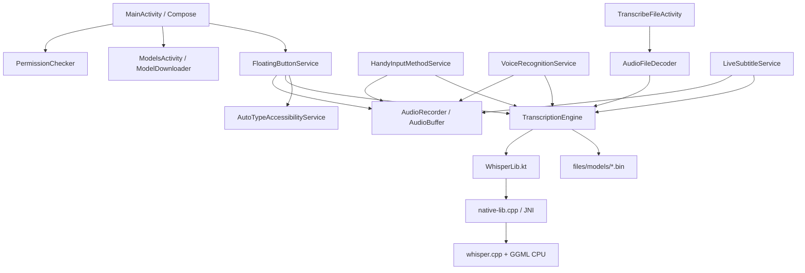

# Handy Android — Especificación técnica viva

> Esta es la especificación técnica vigente del módulo Android `com.handy.android`. Describe su arquitectura actual, las decisiones verificadas y las limitaciones conocidas.

## 1. Alcance

Handy Android es el port móvil de la experiencia local de Handy de escritorio:

1. capturar voz desde Android;
2. ejecutar Whisper/GGML localmente;
3. mostrar estado mediante overlay o IME;
4. insertar el texto en el campo enfocado o devolverlo a un cliente Android;
5. permitir gestión local de modelos.

El proyecto Android vive como módulo Gradle independiente en la raíz. La aplicación Tauri sigue siendo el producto de escritorio y tiene su propio backend Rust, frontend y pipeline de build.

## 2. Arquitectura



### Componentes

- `MainActivity.kt`: onboarding, estado de permisos y navegación.
- `PermissionState.kt`: micrófono, notificaciones Android 13+, overlay y accesibilidad.
- `AudioRecorder.kt`: `AudioRecord` en 16 kHz mono PCM 16-bit.
- `AudioBuffer.kt`: buffer thread-safe; ofrece snapshot y `drain(maxSamples)` para ventanas de streaming.
- `FloatingButtonService.kt`: foreground service de micrófono con botón overlay.
- `AutoTypeAccessibilityService.kt`: busca el campo de entrada enfocado y ejecuta `ACTION_SET_TEXT`.
- `HandyInputMethodService.kt`: IME con botón de grabación y `commitText`.
- `VoiceRecognitionService.kt` y `RecognizeActivity.kt`: APIs de reconocimiento del sistema.
- `ModelsActivity.kt`: descarga, importación, validación y selección explícita de modelos.
- `ModelDownloader.kt`: descarga HTTPS a `.part`, validación SHA-256/Whisper y reemplazo final del modelo.
- `ModelValidator.kt`: hash SHA-256, metadata local y carga real mediante JNI antes de activar.
- `AudioFileDecoder.kt`: MediaExtractor/MediaCodec, mono y resampling a 16 kHz.
- `TranscribeFileActivity.kt`: entrada `ACTION_VIEW`/`ACTION_SEND`, `ClipData` y URI `content://`.
- `LiveSubtitleService.kt`: overlay foreground y ventanas periódicas de transcripción local.
- `WhisperLib.kt`: wrapper lifecycle-safe del contexto nativo.
- `native-lib.cpp`: carga, inferencia greedy, mutex por contexto y conversión de errores JNI.

## 3. Build Android

Configuración actual:

- namespace/application ID: `com.handy.android`;
- `compileSdk = 35`, `targetSdk = 35`, `minSdk = 26`;
- JDK 17;
- Gradle wrapper 8.9;
- Android Gradle Plugin 8.7.3;
- Kotlin 2.0.21;
- CMake 3.22.1;
- NDK 27.0.12077973;
- ABIs que actualmente compila la configuración local: `armeabi-v7a`, `arm64-v8a`, `x86`, `x86_64`; la lista de ABIs con soporte oficial de distribución debe fijarse explícitamente antes de publicar, idealmente mediante `abiFilters`;
- backend nativo actual: CPU portable; Vulkan, OpenCL, Metal, OpenMP y `GGML_NATIVE` están desactivados deliberadamente.

Comandos canónicos:

```bash
./gradlew lintDebug
./gradlew testDebugUnitTest
./gradlew assembleDebug
./gradlew assembleRelease
```

La CI `.github/workflows/android.yml` instala explícitamente SDK 35, Build Tools 35.0.0, CMake 3.22.1 y NDK 27.0.12077973.

## 4. JNI y Whisper/GGML

Las firmas JNI deben coincidir exactamente con `WhisperLib.kt`:

```cpp
Java_com_handy_android_WhisperLib_initContext
Java_com_handy_android_WhisperLib_freeContext
Java_com_handy_android_WhisperLib_fullTranscribe
```

El contexto nativo contiene `whisper_context*` y un mutex. La inferencia usa muestreo greedy, idioma configurable, traducción opcional y sin timestamps visibles. `WhisperLib.close()` libera el contexto; las reglas R8 mantienen la clase y sus métodos JNI durante la compilación release. La ejecución de una release instalada todavía debe validarse aparte.

La inferencia nativa es síncrona y actualmente no cancelable desde Kotlin mientras `whisper_full` está ejecutándose. Cualquier diseño de streaming debe serializar ventanas y descartar resultados obsoletos antes de actualizar UI/overlay.

## 5. Audio

`AudioRecorder` solicita `RECORD_AUDIO`, crea `AudioRecord` con:

- `MediaRecorder.AudioSource.MIC`;
- 16.000 Hz;
- `CHANNEL_IN_MONO`;
- `ENCODING_PCM_16BIT`.

`AudioBuffer` normaliza `ShortArray` dividiendo por `32768.0f`. El servicio de subtítulos usa una ventana máxima de ocho segundos; si la inferencia tarda más, puede perderse audio intermedio de forma intencional para evitar crecimiento indefinido. Es una implementación periódica funcional, no todavía un streaming incremental equivalente al pipeline de escritorio.

`AudioFileDecoder` decodifica tracks de audio compatibles con MediaCodec, mezcla canales a mono y resamplea linealmente a 16 kHz.

## 6. Permisos y componentes de sistema

El manifest declara:

- `RECORD_AUDIO`;
- `POST_NOTIFICATIONS`;
- `SYSTEM_ALERT_WINDOW`;
- `FOREGROUND_SERVICE`;
- `FOREGROUND_SERVICE_MICROPHONE`;
- `INTERNET`.

La accesibilidad no se concede como runtime permission: el usuario debe activarla en ajustes. El overlay también se habilita desde ajustes. Android 13+ requiere notificaciones para la experiencia foreground visible.

## 7. Modelos

Los modelos viven en:

```text
/data/user/0/com.handy.android/files/models/*.bin
```

La selección se persiste en `files/active_model`. Solo se consideran seleccionables los modelos `.bin` cuyo digest sidecar local coincide con el contenido actual y que ya fueron cargados correctamente por Whisper. Si la selección desaparece, el motor cae al primer modelo validado local ordenado por nombre; nunca activa silenciosamente un `.bin` sin validar.

Descarga e importación:

1. se crea un archivo `.part`;
2. se copia/descarga completamente;
3. se calcula SHA-256 y, si el catálogo lo publica, se compara contra la huella esperada;
4. se carga el archivo temporal con el motor Whisper/GGML real;
5. se mueve a la ruta final con reemplazo cuando es posible;
6. se guarda `<modelo>.bin.sha256` mediante reemplazo atómico;
7. queda instalado y validado, pero la activación requiere la acción explícita “Validate and use”.

Los modelos importados o descargados sin checksum remoto conocido sí reciben un SHA-256 local y validación estructural mediante Whisper, pero ese digest local no prueba la procedencia del archivo. Por eso no se inventan huellas remotas y no se activa automáticamente ningún modelo. Si el contenido cambia, el sidecar deja de coincidir y el modelo vuelve a quedar inutilizable hasta repetir la validación.

## 8. Audio compartido y URI

`TranscribeFileActivity` acepta `ACTION_VIEW` y `ACTION_SEND` para audio. Resuelve:

- `Intent.data`;
- `Intent.EXTRA_STREAM` con bifurcación API 33;
- primer elemento no vacío de `ClipData`.

Antes de habilitar el botón verifica que `ContentResolver.openFileDescriptor(uri, "r")` pueda abrir el documento. Los permisos temporales recibidos se intentan persistir para URI `content://`.

El caso `file:///sdcard/...` puede seguir siendo ilegible en Android moderno si el emisor no concede acceso. El flujo recomendado es `content://` con `FLAG_GRANT_READ_URI_PERMISSION`.

## 9. Estado verificado

Validaciones realizadas:

- `lintDebug`: correcto;
- `testDebugUnitTest`: correcto, con tests JVM de `AudioBuffer`;
- `assembleDebug`: correcto;
- `assembleRelease`: correcto;
- instalación incremental en Android 16 ARM64: correcta;
- onboarding y cuatro capacidades: correctos en el dispositivo de prueba;
- foreground overlay y accesibilidad: correctos;
- carga real de `ggml-tiny.en.bin` y JNI: sin crash;
- decoder privado y ejecución Whisper: sin crash.

El fixture sintético utilizado terminó en `No speech detected`; aún hace falta una prueba con voz humana y texto esperado.

## 10. Limitaciones y siguientes decisiones

### Release blockers

- mantener el módulo Android, su workflow y la documentación en un checkout limpio y reproducible;
- firma de APK/AAB y configuración de distribución;
- checksums oficiales autenticados para los modelos del catálogo (los sidecars locales no sustituyen esta procedencia);
- tests instrumentados y prueba de regresión de voz humana;
- decidir una política de cancelación/cola para inferencia JNI.

### Paridad pendiente

- postprocesado configurable;
- fallback de escritura para apps que no soporten `ACTION_SET_TEXT`;
- internacionalización Android;
- cache compartida de modelo para evitar recargar Whisper en cada transcripción;
- medición y eventual aceleración ARM/GPU;
- historial y funciones de producto de escritorio que todavía no tienen equivalente móvil.
